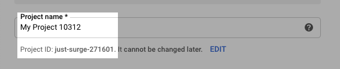
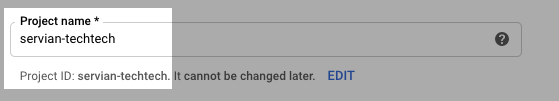

# Prerequisites

- The [gcloud cli installed.](https://cloud.google.com/sdk/docs)
- Running on macos or linux.
## gcloud Permissions

This solution requires the user [authenticated via gcloud](https://cloud.google.com/sdk/docs/authorizing) for first time setup, to have the Project Owner role.

## Project setup
The GCP Project that is being used should be created in the [Google Cloud Console](https://console.cloud.gooogle.com). Use a project name specific enough to have the project id and project name which are the same.

### Bad
 
### Good


## gcloud Project Config
gcloud should be configured to use the new, blank project.

```bash
$ gcloud config set project <project_id>
Updated property [core/project].
```


All other prerequisites are managed by the initialise script as documented in the [process instructions](PROCESS_INSTRUCTIONS.md).